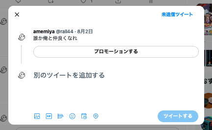

## はじめまして！

---

## rail44 (Satoshi Amemiya)

- 2017 年新卒入社
- Treasure は 2015 年に参加したらしい
  - 当時は PHP + jQuery だった
- fluct という会社で広告配信システムを作っています

---

## rail44 (Satoshi Amemiya)

- 普段の仕事
  - https://techlog.voyagegroup.com/entry/ad-javascript
  - 実はあんま React とか Vue とか使ってない
- 普段の趣味
  - https://github.com/rail44
  - 実は Rust ばっかりさわってる

---

## Slack の `#frontend` でわいわいやりましょう！

---

## Introduction

---

<!--
_header: 'Introduction'
-->

## 講義の目的

- チーム開発で作りたいものを React で最低限書けるようになる
- React の機能や設計がどういった狙いの元に用意されているのかをなんとなく知る
- フロントエンド開発の醍醐味を垣間見る
- ディスカッションしてみよう

---

<!--
_header: 'Introduction'
-->

## Web フロントエンドとはどういう特徴を持った領域だろう

アイスブレイクがてら

---

<!--
_header: 'Introduction'
-->

## Web フロントエンドとはどういう特徴を持った領域だろう

2 つの軸で考えてみよう

- フロントエンド <-> 非フロントエンド
- Web <-> 非 Web(iOS とか Android とか)

---

<!--
_header: 'Introduction'
-->

## フロントエンド <-> 非フロントエンド

かいてみよう

---

<!--
_header: 'Introduction'
-->

## フロントエンド <-> 非フロントエンド

- イベントドリブン
  - ユーザーの操作起点
- ユーザー端末でプログラムが動作する
- 状態遷移のライフサイクルが最も頻繁

---

<!--
_header: 'Introduction'
-->

## Web <-> 非 Web

かいてみよう

---

<!--
_header: 'Introduction'
-->

## Web <-> 非 Web

- JavaScript(最近は WASM とかも盛り上がりがあるものの)
- オープン
  - Proposal, RFC
- マルチプラットフォーム
  - デバイス
  - OS
  - ブラウザ
- deliver がオンデマンド

---

<!--
_header: 'Introduction'
-->

## まあ、いろいろあるが……

---

<!--
_header: 'Introduction'
-->

## 逆に言えば、これら以外はそんな変わらないとも言える

良いとされるコードの要件は実はだいたい一緒

---

<!--
_header: 'Introduction'
-->

## 良いとされているコードとは

- 純粋な関数
- 引数や依存している変数が少ない
- 命名がわかりやすい
- 静的に安全性が担保されている
- 手続きや条件分岐が明快
- 高速

とかとか

---

## 事前課題のおさらいと React の基礎

---

<!--
_header: 事前課題のおさらいと React の基礎
-->

## おさらい: 事前課題 1 について

TypeScript について

---

<!--
_header: 事前課題のおさらいと React の基礎
-->

## おさらい: 事前課題 2 について

Article を投稿する課題

- JSX で簡単なテンプレートを記述できるように
  - マークアップ
  - イベントハンドラ
- useState()がなんとなく使えるように

---

<!--
_header: 事前課題のおさらいと React の基礎
-->

## おさらい: 事前課題 3 について

Article を取得する課題

- HTTP クライアントでデータを取得
- React の State として設定

---

<!--
_header: 事前課題のおさらいと React の基礎
-->

## 演習 1: 記事を Update できるページを作りたい

ひとまず手を一緒に動かしてみよう

### 最初に手をつけるとよさそうなところ

- `/page` に新しいファイルを作成
- ルーティングの追加

---

<!--
_header: 事前課題のおさらいと React の基礎
-->

## 演習 1: 記事を Update できるページを作りたい

### どうやって作るものを考えていくか

---

<!--
_header: 事前課題のおさらいと React の基礎
-->

## 演習 1: 記事を Update できるページを作りたい

### 機能の分解

- どんな機能を達成することが要件なのか
- どんな情報を外部から取得する必要があるか
- どんな状態と状態遷移を内部に持つのか
- どんな変更を上位ライフサイクルな状態に加える必要があるか

---

<!--
_header: 事前課題のおさらいと React の基礎
-->

## 演習 1: 記事を Update できるページを作りたい

### 機能の分解

- どんな機能を達成することが要件なのか
  - 記事の更新
- どんな情報を外部から取得する必要があるか
  - 記事情報
- どんな状態と状態遷移を内部に持つのか
  - 入力されている記事情報
- どんな変更を上位ライフサイクルな状態に加える必要があるか
  - DB に保存された記事情報の更新

---

<!--
_header: 事前課題のおさらいと React の基礎
-->

## 演習 1: 記事を Update できるページを作りたい

### 機能の分解

- どんな機能を達成することが要件なのか
  - (ある ID を Primary Key として持つ)記事の更新

---

<!--
_header: 事前課題のおさらいと React の基礎
-->

## 演習 1: 記事を Update できるページを作りたい

### 機能の分解

- どんな情報を外部から取得する必要があるか
  - DB に保存されている記事情報
  - ID から引いてくる

---

<!--
_header: 事前課題のおさらいと React の基礎
-->

## 演習 1: 記事を Update できるページを作りたい

### 機能の分解

- どんな状態と状態遷移を内部に持つのか
  - 記事情報
    - title
    - body

---

<!--
_header: 事前課題のおさらいと React の基礎
-->

## 演習 1: 記事を Update できるページを作りたい

### 機能の分解

- どんな変更を上位ライフサイクルな状態に加える必要があるか
  - DB に保存された記事情報の更新
    - API を発行する

---

<!--
_header: 事前課題のおさらいと React の基礎
-->

## 演習 1: 記事を Update できるページを作りたい

```typescript
export const Component: React.FC<Props> = (props) => {
  const [state, setState] = useState(null);

  return (
    <div>
      <button onClick={onClick}>コンポーネントだよ〜</button>
    </div>
  );
};
```

コンポーネントに、分解した機能がそれぞれ宣言的に現れていることに注意

---

<!--
_header: 事前課題のおさらいと React の基礎
-->

## 演習 1: 記事を Update できるページを作りたい

雑なことを書くと

- どんな情報を外部から取得する必要があるか
  - props
- どんな状態と状態遷移を内部に持つのか
  - state
- どんな変更を上位ライフサイクルな状態に加える必要があるか
  - イベントハンドラ

のようなコードになるのが典型的

---

<!--
_header: 事前課題のおさらいと React の基礎
-->

## 演習 1: 記事を Update できるページを作りたい

### 画面共有しながら

---

<!--
_header: 事前課題のおさらいと React の基礎
-->

## 課題 1: 記事を Delete できるページを作りたい

ここまでの話と、変更を取り込んでパッチを投げる開発の流れの確認のための課題です

---

<!--
_header: 事前課題のおさらいと React の基礎
-->

### Tips: React Extension

Chrome の方
[React Developer Tools](https://chrome.google.com/webstore/detail/react-developer-tools/fmkadmapgofadopljbjfkapdkoienihi?hl=ja)

Edge の方
[React Developer Tools](https://microsoftedge.microsoft.com/addons/detail/react-developer-tools/gpphkfbcpidddadnkolkpfckpihlkkil)

Firefox の方
[React Developer Tools](https://addons.mozilla.org/ja/firefox/addon/react-devtools/)

Props や 各 Hooks の値が見えたりするので便利

---

<!--
_header: 事前課題のおさらいと React の基礎
-->

## 課題 1: 記事を Delete できるページを作りたい

#### 進め方

- origin/main を base に、各々のトピックブランチを作りましょう
  - git switch main
  - git pull
  - git switch -c your-name-frontend-practice-1

---

<!--
_header: 事前課題のおさらいと React の基礎
-->

## 課題 1: 記事を Delete できるページを作りたい

#### 作り方の選択肢や、その選択のメリット/デメリットについてディスカッションしてみましょう

たとえば

- ページの URL の設計
  - `/articles/delete?id=`
  - `/articles/{id}/delete`
  - ほかにも色々考えられるが、それぞれどんな特徴が生まれるか
- UX を考えたときにもっと便利にもできそうだが、どの辺りが考えられるか
  - UI 上の表現
  - エラーのフィードバック

---

## 僕らは React になにをお願いしているのか

---

<!--
_header: 僕らは React になにをお願いしているのか
-->

## おさらい: Functonal Component について

```typescript
export const HogeComponent: React.FC<Props> = (props) => {
  return (
    <div>
      <p>コンポーネントだよ〜</p>
    </div>
  );
};
```

### なにこれ？

### なにが嬉しいんだっけ

---

<!--
_header: 僕らは React になにをお願いしているのか
-->

## Functional Component について

https://github.com/DefinitelyTyped/DefinitelyTyped/blob/93ea81ea86bdf0d6647f74089711079308685c7a/types/react/index.d.ts#L519

---

## Functional Component について

https://ja.reactjs.org/docs/react-api.html#createelement

---

<!--
_header: 僕らは React になにをお願いしているのか
-->

## Functional Component について

```typescript
export const HogeComponent: React.FC<Props> = (props) => {
  return React.createElement("div", null, [
    React.createElement("p", null, "コンポーネントだよ〜"),
  ]);
};
```

型定義通り、「単に props を引数として ReactElement を返す関数」

今回のベースアプリの環境ではビルドに vite を使用しています

---

<!--
_header: 僕らは React になにをお願いしているのか
-->

## すこしだけ昔話をします

---

<!--
_header: 僕らは React になにをお願いしているのか
-->

## すこしだけ昔話をします

DOM API ベースでアプリケーションを作ると、どうしても状態遷移の多いコードになる

---

<!--
_header: 僕らは React になにをお願いしているのか
-->

```html
<button onclick="append()">append</button>
<button onclick="remove()">remove</button>
<ul id="list"></ul>

<script>
  let i = 0;
  let list = $("#list");
  function append() {
    const child = document.createElement("li");
    ...
    list.appendChild(chlid);
    i++;
  }

  function remove() {
    list.removeChild(list.lastChild);
    i--;
  }
</script>
```

---

<!--
_header: 僕らは React になにをお願いしているのか
-->

## 問題点

- append()も remove()も、実行する度に結果が変わる
  - アプリケーションの状態へ依存している
- ロジックが複雑になると、状態へ加えるべき変更も複雑化していく
  - append/remove する要素を指定したくなったらどう記述すればよいだろうか？

---

<!--
_header: 僕らは React になにをお願いしているのか
-->

## どうする？

---

<!--
_header: 僕らは React になにをお願いしているのか
-->

## どうする？

アプリケーションの状態から一意な DOM 表現を返すような関数を定義してしまおう

---

<!--
_header: 僕らは React になにをお願いしているのか
-->

```javascript
function getListChild(counter) {
  let el = document.createElement("li");
  ...
  return el;
}

function getListView(counter) {
  let list = document.createElement("li");
  for (let i = 0; i < counter; i++) {
    list.appendChild(getListChild(i));
  }
  return list;
}
```

---

<!--
_header: 僕らは React になにをお願いしているのか
-->

## 問題点

- 状態遷移の度に DOM Tree が全部書き変わってしまう
- DOM API でのビュー構築は可読性に乏しい

---

<!--
_header: 僕らは React になにをお願いしているのか
-->

# React

---

<!--
_header: 僕らは React になにをお願いしているのか
-->

```javascript
function ListChild(counter) {
  return <li>{counter}</li>;
}

function ListView(counter) {
  return (
    <ul>
      { [...Array(counter).keys()].map((i) => getListChild(i) }
    </ul>
  );
}
```

「単に props を引数として ReactElement を返す関数」

---

<!--
_header: 僕らは React になにをお願いしているのか
-->

## React がなぜまるっと DOM を宣言的に書くことを許容できるのか

- Virtual DOM
  - diff
  - patch

今まで人間が状態の差分からビューへ加える変更を考えていたのをランタイムが吸収してくれている

( https://github.com/jorgebucaran/hyperapp/ というライブラリが、ここのロジックをとても読み易いコードになっているのでおすすめ

---

<!--
_header: 僕らは React になにをお願いしているのか
-->

## ここまでが、いわゆる「なぜ魂が震えるのか」の話

https://qiita.com/mizchi/items/4d25bc26def1719d52e6

- Virtual DOM という発明により Web フロントエンドの世界に、純粋な関数の威力を持ち込むことに成功した
- べつに React でもなんでもいいのだけれど、依存関係の減った宣言的なコードになっているのが大事
  - 最近だとコンパイル(コンパイルとは言っていない)時に最適化をするアプローチが注目されているが、根底は一緒

---

<!--
_header: 僕らは React になにをお願いしているのか
-->

## せっかく React を導入しているのだから、その恩恵を思いっきり享受できるように書いていこう！

- 宣言的に
- 各クラス/関数の依存を少なくシンプルに

---

## 汎用的なコンポーネントを書いてみよう

---

<!--
_header: 汎用的なコンポーネントを書いてみよう
-->

## 汎用的なコンポーネントを書いてみよう

巷の Web アプリの便利さを見にいく

---

<!--
_header: 汎用的なコンポーネントを書いてみよう
-->

## 汎用的なコンポーネントを書いてみよう

たとえば、いちいち画面遷移をするには煩雑なアクションがあったりする



---

<!--
_header: 汎用的なコンポーネントを書いてみよう
-->

## 演習 2: 確認モーダルを作ってみよう

`git checkout -b name-front-kadai-3`

`components/Modal` に雛形がある

---

<!--
_header: 汎用的なコンポーネントを書いてみよう
-->

## 演習 2: モーダルを作ってみよう

`git checkout -b name-front-kadai-3`

`components/Modal` に雛形がある

---

<!--
_header: 汎用的なコンポーネントを書いてみよう
-->

## 演習 2: 確認モーダルを作ってみよう

### 機能の分解

- どんな機能を達成することが要件なのか
- どんな情報を外部から取得する必要があるか
- どんな状態と状態遷移を内部に持つのか
- どんな変更を上位ライフサイクルな状態に加える必要があるか

---

<!--
_header: 汎用的なコンポーネントを書いてみよう
-->

## 演習 2: 確認モーダルを作ってみよう

### 機能の分解

- どんな機能を達成することが要件なのか
  - 記事投稿確認モーダルの表示
- どんな情報を外部から取得する必要があるか
  - 表示されているかどうか (isVisible とか？)
- どんな状態と状態遷移を内部に持つのか
  - たとえば閉じるボタンクリックしたら閉じれるとか
- どんな変更を上位ライフサイクルな状態に加える必要があるか
  - Ok/Discard のような選択肢それぞれで発生させたい Action が異なる

---

<!--
_header: 汎用的なコンポーネントを書いてみよう
-->

## 演習 2: モーダルを作ってみよう

画面映しつつ作ってみる

---

<!--
_header: 汎用的なコンポーネントを書いてみよう
-->

## 課題 2: モーダルで編集できるようにしてみよう

今作ったモーダルで、記事の編集ができるようにしてみましょう

---

<!--
_header: 汎用的なコンポーネントを書いてみよう
-->

## 課題 2: モーダルで編集できるようにしてみよう

### ディスカッションしてみよう

ブレイクアウトルームに分かれて話し合ってみましょう

- どんな情報を外部から与えたくなりそう？
  - 言いかえると、モーダルはどういう状態を Props として持ちそう？
  - あるいは、モーダルとはどういう風な使い方ができると便利なコンポーネントになりそうだろうか？
- どういう粒度でコンポーネントを定義/切り分けていくとよさそうだろうか

---

<!--
_header: 汎用的なコンポーネントを書いてみよう
-->

## コンポーネントの設計時に考えていること

- 管理している状態の粒度が適切かどうか
- 外部へ公開している情報が適切かどうか

---

<!--
_header: 汎用的なコンポーネントを書いてみよう
-->

## 管理している状態の粒度が適切かどうか

- フロントエンドに閉じているのかどうか
- 変更のライフサイクルをよく考えていると思います

どの粒度の状態管理の責任を持つのかが明確だと、コンポーネントの作りがシンプルになります

---

<!--
_header: 汎用的なコンポーネントを書いてみよう
-->

## 外部へ公開している情報が適切かどうか

- export, public, ディレクトリ構成
- ドメインの境界をよく考えていると思います

期待される使われ方がコード上に表明できているかがポイントです

<!--
_header: 汎用的なコンポーネントを書いてみよう
-->

## 課題 3: 記事をモーダルで削除できるようにしてみよう

機能を作るごとに、共通パーツがリッチになっていくのを確認しながら作ってみましょう

---

<!--
_header: 汎用的なコンポーネントを書いてみよう
-->

## 課題 4: (時間が余った人向け)モーダルをリッチな見た目にしてみよう
